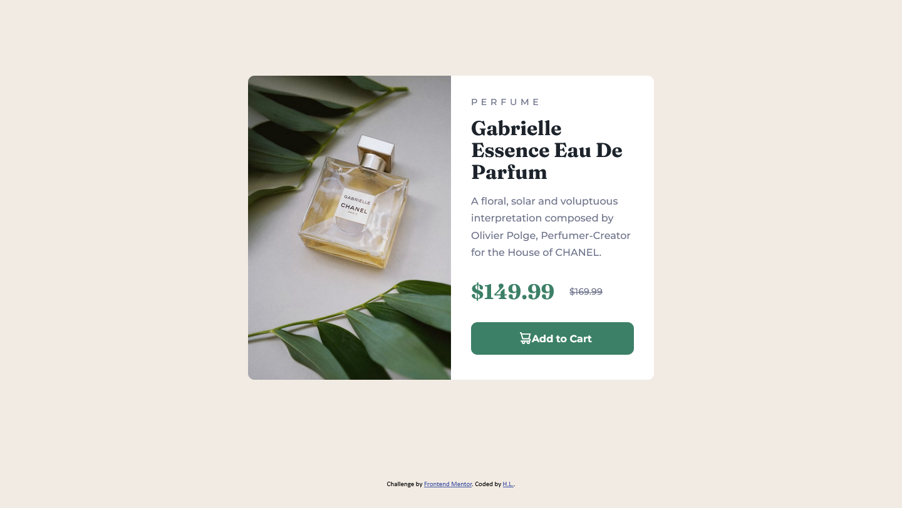
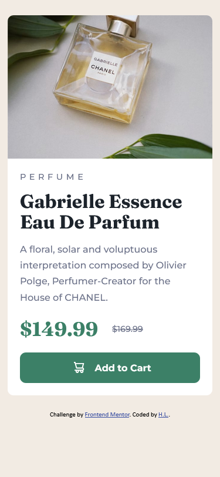

# Frontend Mentor - Product preview card component solution

This is a solution to the [Product preview card component challenge on Frontend Mentor](https://www.frontendmentor.io/challenges/product-preview-card-component-GO7UmttRfa). Frontend Mentor challenges help you improve your coding skills by building realistic projects. 

## Table of contents

- [Overview](#overview)
  - [The challenge](#the-challenge)
  - [Screenshot](#screenshot)
  - [Links](#links)
- [My process](#my-process)
  - [Built with](#built-with)
  - [What I learned](#what-i-learned)
  - [Continued development](#continued-development)
  - [Useful resources](#useful-resources)
- [Author](#author)

**Note: Delete this note and update the table of contents based on what sections you keep.**

## Overview

### The challenge

Users should be able to:

- View the optimal layout depending on their device's screen size
- See hover and focus states for interactive elements

### Screenshot

### Links

- Live Site URL: (https://hran-8.github.io/product-preview-card/)

## My process

I started with the mobile layout first. I created classes and added some semantic HTML elements as needed. I tried to do all the visual styling first, like colors, backgrounds, and font families. Then, I moved to positioning and then margins/padding/sizing. I struggled a bit when I tried to move onto the desktop layout because the image wasn't scaling properly alongside the container. I'm still struggling with this. 

### Built with

- Semantic HTML5 markup
- CSS custom properties
- Flexbox
- Mobile-first workflow

### What I learned

I learned a lot about workflow. I would previously start out trying to make the desktop version and downsizing it, but it is much easier to start mobile. I also learned how to keep things as responsive as possible by using relative units rather than pixels, although I'm still having trouble. Using different images depending on the width of the viewport was also new to me and I learned about the srcset attribute.

### Continued development

I still struggle with responsiveness; my website breaks when the viewport width is anywhere between 375px and 1440px. I want to find a solution to this without making a bunch of media queries. 

### Useful resources

- Kevin Powell's tips for beginners on his YouTube channel really helped me understand the workflow better and start projects with more organization.
- Viewing MDN for properties and values I wasn't sure about/forgot was useful.

## Author

- Website - [H.L.] (no website yet)
- Frontend Mentor - [@hran](https://www.frontendmentor.io/profile/hran-8)
- Twitter - [@hran_8](https://www.twitter.com/hran_8)
